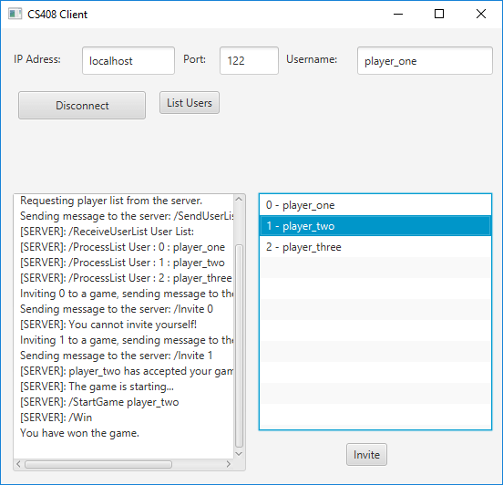
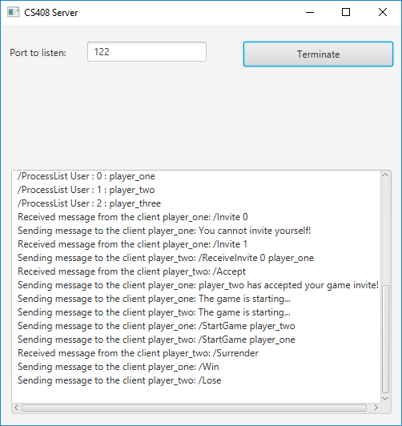

# Guessing game
Client             |  Server
:-------------------------:|:-------------------------:
  |  

This is a repository of a number guessing game.

The game currently consists of multiple clients and the server, clients try to guess a number that has been randomly generated by the server.

## How to play: 

Install java from https://www.java.com/en/download/, clone the repository and follow these steps:
1. Run the server.jar file located in builds, choose a port and click listen.
2. Run the client.jar file located in builds for each desired client instance, enter the ip address and port of the server and connect. 
3. Click List users on all of the clients.
4. Invite a user to a duel on any of the clients by selecting the user and clicking invite.

